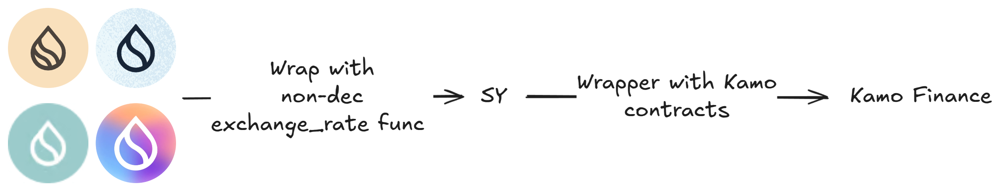

# SY

<figure><figcaption></figcaption></figure>

**Overview**\
SY is a token standard that implements a standardized API for wrapped yield-bearing tokens within smart contracts. Traditionally, a single wrapper was used to convert yield-bearing tokens into SY, providing a unified interface for all yield-bearing tokens in DeFi. However, to enhance flexibility and composability, we have introduced a dual-wrapper architecture.

**The Dual-Wrapper Design**

1. **First Wrapper: Non-Decreasing Exchange Rate Function**\
   The first wrapper converts yield-bearing tokens into an SY token with a non-decreasing `exchange_rate` function. This mechanism The first wrapper converts yield-bearing tokens into an SY token with a non-decreasing `exchange_rate` function. This mechanism ensures that the value of the SY token consistently increases over time, reflecting the yield generated by the underlying asset.
   1. **Note:** If the yield-bearing token natively supports a non-decreasing exchange rate, the first wrapping step is not needed. The token will directly move to the second wrapping phase, avoiding unnecessary conversions.
2. **Second Wrapper: Kamo Finance API Compatibility**\
   The SY token is then wrapped again with an API that is fully compatible with Kamo Finance contracts. This additional wrapper enables advanced DeFi functionalities such as minting PT (Principal Tokens) and YO (Yield Object) and trading PT against SY in Kamo AMM pools. The API compatibility with Kamo Finance also allows seamless integration into the Kamo ecosystem, enhancing liquidity and trading opportunities for SY tokens.

**How It Works in Practice**\
When a user deposits a yield-bearing token:

* It is first wrapped into an SY token with a non-decreasing exchange rate function.
* Then, the SY token is wrapped with the Kamo-compatible API, unlocking advanced DeFi features.

This dual-wrapper approach happens automatically behind the scenes, offering a smooth and intuitive experience for users, who interact with their yield-bearing tokens directly on the platform without needing to handle the SY conversion manually.

